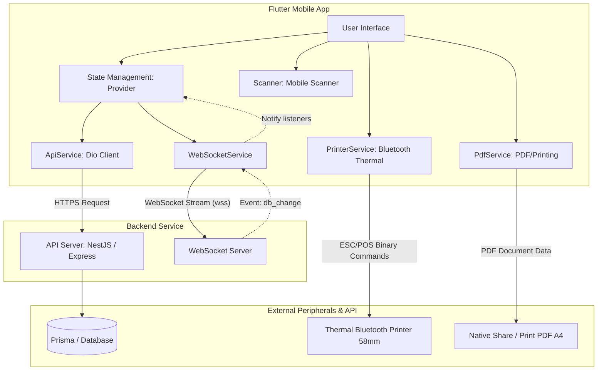
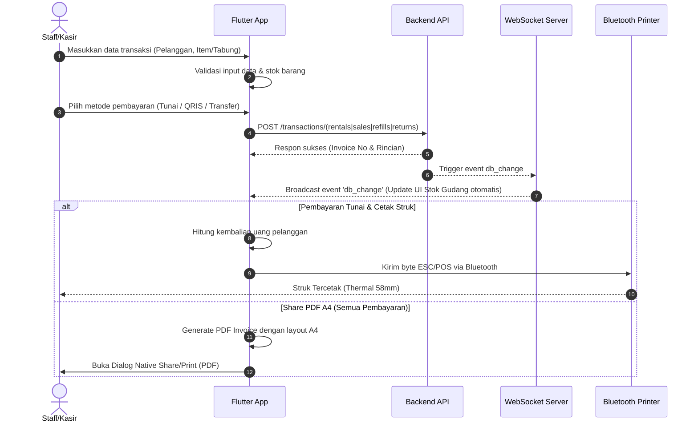
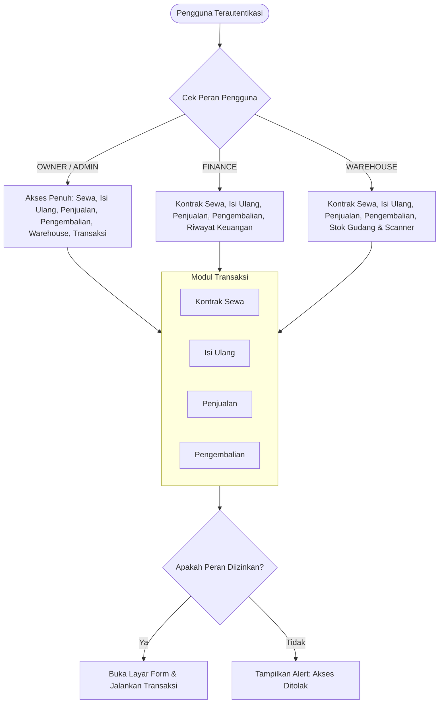

# Oksigen24 Medis (Mobile POS & Cylinder Management App)

[](https://flutter.dev)
[](https://dart.dev)
[](https://opensource.org/licenses/MIT)

**Oksigen24 Medis Mobile** adalah aplikasi POS (Point of Sale) dan manajemen inventaris tabung oksigen medis berbasis Flutter. Aplikasi ini dirancang untuk mempermudah operasional kasir dan petugas gudang dalam mengelola transaksi penyewaan (rental), pengisian ulang (refill), penjualan tabung/aksesoris, serta pelacakan status tabung secara *real-time* menggunakan sensor barcode/QR dan sinkronisasi WebSocket.

---

## 📌 Fitur Utama

- **Role-Based Access Control (RBAC)**: Pembatasan akses modul transaksi dan gudang sesuai dengan hak akses pengguna (`OWNER`, `ADMIN`, `FINANCE`, `WAREHOUSE`).
- **Autentikasi Aman & Auto-Refresh**: Integrasi token JWT (Access Token & Refresh Token) dengan mekanisme in-memory cache dan fallback penyimpanan lokal (`SharedPreferences`).
- **Manajemen Inventaris Tabung & Produk**:
  - Pelacakan tabung fisik berdasarkan Serial Number (status: `AVAILABLE`, `EMPTY`, `RENTED`, `AT_VENDOR`, `MAINTENANCE`).
  - Pemisahan aset tabung oksigen utama dengan aksesoris pendukung (regulator, troli, dll).
  - Monitoring stok kritis barang yang siap jual.
- **Modul Transaksi Terpadu**:
  - **Kontrak Sewa (Rental)**: Pencatatan sewa tabung baru beserta deposit jaminan.
  - **Isi Ulang (Refill)**: Layanan isi ulang oksigen ke tabung milik pelanggan atau tabung sewaan.
  - **Penjualan (Sales)**: Penjualan produk/aksesoris medis secara langsung.
  - **Pengembalian (Return)**: Pengembalian tabung sewaan dan klaim pengembalian deposit secara fleksibel.
- **Integrasi Hardware (Scanner & Printer)**:
  - **QR/Barcode Scanner**: Menggunakan kamera perangkat via `mobile_scanner` untuk pencarian instan tabung atau produk di gudang.
  - **Bluetooth Thermal Printer (58mm)**: Cetak struk pembayaran kasir menggunakan format perintah biner ESC/POS langsung ke printer thermal bluetooth portabel.
  - **PDF Generator & Native Share**: Pembuatan faktur/invoice berukuran A4 (PDF) yang siap dibagikan via WhatsApp/Email atau dicetak ke printer standar.
- **Sinkronisasi WebSocket Real-Time**: Sinkronisasi data stok gudang secara instan ketika ada transaksi masuk tanpa perlu melakukan *pull-to-refresh* manual.

---

## 📐 Arsitektur & Alur Data

### 1. Arsitektur Sistem

Aplikasi Flutter berkomunikasi dengan server backend REST API & WebSocket, serta terhubung dengan perangkat periferal eksternal seperti printer bluetooth dan sistem share dokumen.



### 2. Alur Transaksi & Pencetakan Struk

Setiap kali transaksi diselesaikan, aplikasi memproses pembayaran, mengirim data ke API, menerima notifikasi perubahan database melalui WebSocket, lalu mencetak struk fisik atau membagikan invoice PDF A4.



### 3. Alur Role-Based Access Control (RBAC)

Modul-modul transaksi dilindungi oleh sistem otorisasi berbasis peran untuk menjaga integritas data keuangan dan operasional.



---

## 🛠️ Tech Stack & Dependensi

| Paket / Dependensi | Versi | Kegunaan Utama |
| :--- | :---: | :--- |
| **Flutter SDK** | `^3.12.2` | Framework UI Lintas Platform |
| **provider** | `^6.1.2` | State Management & Dependency Injection |
| **dio** | `^5.7.0` | HTTP Client dengan Interceptor Token & Auto-refresh |
| **web_socket_channel** | `^3.0.1` | Komunikasi WebSocket dua arah secara real-time |
| **print_bluetooth_thermal**| `^1.2.2` | Koneksi & Cetak ke Printer Thermal Bluetooth portabel |
| **pdf** | `^3.10.8` | Pembuatan file dokumen PDF kustom |
| **printing** | `^5.11.0` | Layanan berbagi dan mencetak dokumen PDF secara native |
| **mobile_scanner** | `^5.1.0` | Pemindaian barcode & QR-code menggunakan kamera |
| **shared_preferences** | `^2.2.3` | Penyimpanan lokal untuk persitensi sesi masuk pengguna |
| **google_fonts** | `^6.2.1` | Tipografi menggunakan Font Google Inter |

---

## 📂 Struktur Proyek

Proyek ini menerapkan pendekatan **Feature-First Architecture** untuk memisahkan logika aplikasi dengan modul-modul bisnis secara terisolasi dan rapi:

```text
lib/
├── core/
│   ├── services/           # Logika integrasi pihak ketiga (API, WS, PDF, Printer)
│   │   ├── api_service.dart
│   │   ├── pdf_service.dart
│   │   ├── printer_service.dart
│   │   └── websocket_service.dart
│   ├── state/              # Global state providers (Auth, Dashboard, Warehouse, Transaksi)
│   │   ├── auth_provider.dart
│   │   ├── dashboard_provider.dart
│   │   ├── transaction_provider.dart
│   │   └── warehouse_provider.dart
│   └── theme/              # Desain sistem warna, tipografi, dan tema aplikasi
│       └── app_theme.dart
├── features/               # Modul fitur berbasis domain fungsional
│   ├── auth/               # Login & Manajemen Sesi
│   ├── dashboard/          # Tampilan Utama & KPI Finansial/Stok
│   ├── notification/       # Notifikasi Sistem
│   ├── payment/            # Pembayaran Kasir & Pilihan Metode Pembayaran
│   ├── profile/            # Pengaturan Profil & Ubah Sandi
│   ├── refill/             # Formulir Pengisian Ulang Tabung
│   ├── rental/             # Formulir Kontrak Sewa Baru
│   ├── return/             # Formulir Pengembalian Tabung Sewa & Retur Deposit
│   ├── sales/              # Formulir Penjualan Produk Medis & Aksesoris
│   ├── transaction/        # Riwayat dan Detail Transaksi
│   └── warehouse/          # Stok Gudang, Detail Item, & Scanner Pemindai
└── main.dart               # Titik masuk utama aplikasi (App Entry Point)
```

---

## 🚀 Memulai Pengembangan

### Prasyarat

Sebelum memulai, pastikan perangkat Anda telah terinstall:
- Flutter SDK (Versi `>=3.12.2`)
- Dart SDK (Versi `>=3.12.2`)
- Android Studio / VS Code dengan Flutter Extension
- Perangkat Android/iOS fisik (Sangat direkomendasikan untuk menguji Bluetooth Printer & Scanner kamera)

### Langkah Instalasi

1. Clone repositori ini ke penyimpanan lokal Anda:
   ```bash
   git clone https://github.com/username/oksigen24medis_mobile2.git
   cd oksigen24medis_mobile2
   ```

2. Unduh semua paket dependensi yang dibutuhkan proyek:
   ```bash
   flutter pub get
   ```

3. Konfigurasi alamat server backend API. Buka file `lib/core/services/api_service.dart` dan ubah konstanta `baseUrl` sesuai alamat server Anda:
   ```dart
   // lib/core/services/api_service.dart
   final Dio dio = Dio(
     BaseOptions(
       baseUrl: 'https://api.oksigen24medis.com', // Ganti dengan IP/Domain server Anda
       connectTimeout: const Duration(seconds: 15),
       receiveTimeout: const Duration(seconds: 15),
       ...
     ),
   );
   ```
   *Catatan: Pastikan juga menyesuaikan alamat WebSocket di file `lib/core/services/websocket_service.dart`.*

4. Jalankan aplikasi pada perangkat atau emulator yang terhubung:
   ```bash
   flutter run
   ```

---

## 🧪 Pengujian & Build

- **Menjalankan Unit/Widget Test**:
  ```bash
  flutter test
  ```
- **Membuat APK Rilis (Android)**:
  ```bash
  flutter build apk --release
  ```
- **Membuat App Bundle (Google Play Store)**:
  ```bash
  flutter build appbundle --release
  ```
- **Membuat Rilis iOS**:
  ```bash
  flutter build ipa --release
  ```

---

## 🛠️ Perbaikan & Peningkatan Terbaru

Berikut adalah beberapa perbaikan dan peningkatan fitur yang baru saja diselesaikan pada sisi Client (Mobile):
1. **Shortcut Popup Stok Masuk**: Menambahkan tombol shortcut langsung untuk **Tambah Vendor** dan **Tambah Barang** pada form Stok Masuk untuk efisiensi operasional.
2. **Lokalisasi Bahasa Indonesia**: Menerjemahkan opsi kategori barang pada form "Tambah Barang" ke Bahasa Indonesia.
3. **Penyaringan Penjualan Tabung**: Memastikan tabung oksigen (aset sirkulasi) tidak dapat diperjualbelikan (hanya untuk rental/refill) dengan memfilternya dari daftar produk penjualan dan menolak scan barcode tabung di halaman Penjualan.
4. **Perbaikan Stok Kritis di Beranda**: Menyertakan detail jumlah stok kritis (format: `0 / 5`) pada kartu peringatan dashboard.
5. **Beautify Dialog Ubah Status**: Mempercantik tampilan dialog "Ubah Status Unit Aset" dengan layout modern serta memperbaiki bug *layout overflow* (lubernya piksel) agar ramah di seluruh ukuran layar.
6. **Optimasi & UI/UX Manual Payment**: Menambahkan icon action intuitif untuk beralih antara pembayaran otomatis (nominal pas) dengan input nominal manual.
7. **Pecah Detail KPI Sewa Aktif**: Memisahkan metrik "Sewa Aktif" di Beranda menjadi kategori detail: Tabung Besar, Tabung Kecil, dan Regulator guna memantau sebaran fisik unit secara lebih presisi.
8. **Interaksi Pencarian & Pemilihan Pelanggan**: Menyediakan komponen dialog pencarian pelanggan (`Customer Picker`) langsung pada form Sewa, Isi Ulang, dan Penjualan untuk mempercepat proses input.
9. **Standardisasi Penamaan & Harga Dinamis**: Menstandarkan pelabelan ukuran unit tabung oksigen di seluruh aplikasi dan menerapkan perhitungan estimasi harga rental/refill yang bersifat reaktif dan computed.
10. **Pengembangan Menu Keamanan & Bantuan**: Memperluas layar profil dengan Bottom Sheet interaktif untuk Keamanan Akun, Pusat Bantuan, serta perbaikan validasi keamanan token FCM.
11. **Keamanan Asinkronisasi (BuildContext Safety)**: Memperbaiki penggunaan `BuildContext` di celah asinkron (`async gaps`) pada form penjualan guna menjamin kestabilan UI ketika data di-submit.
